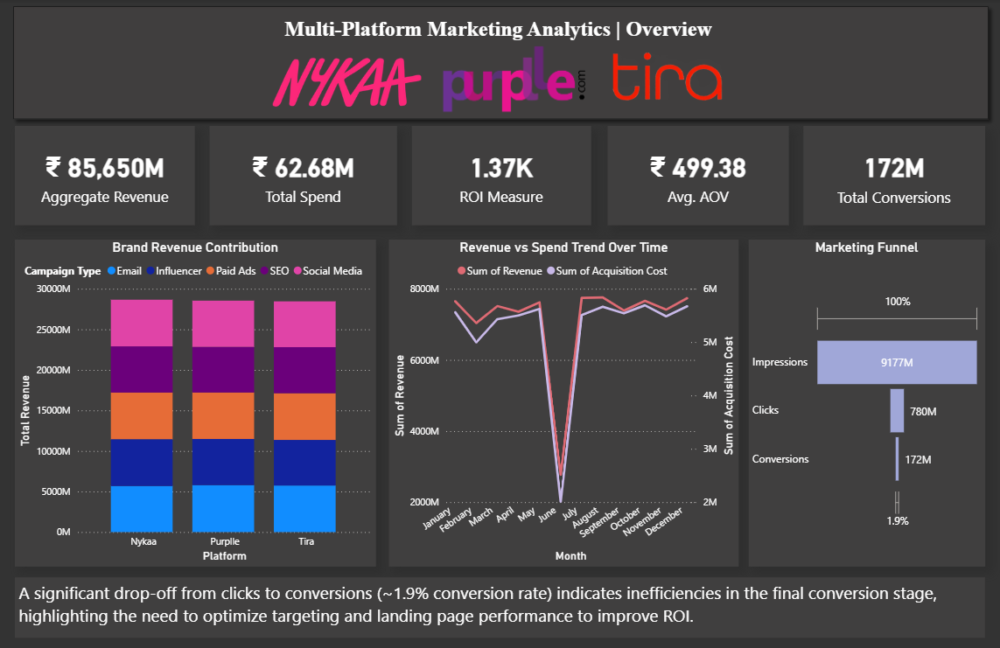
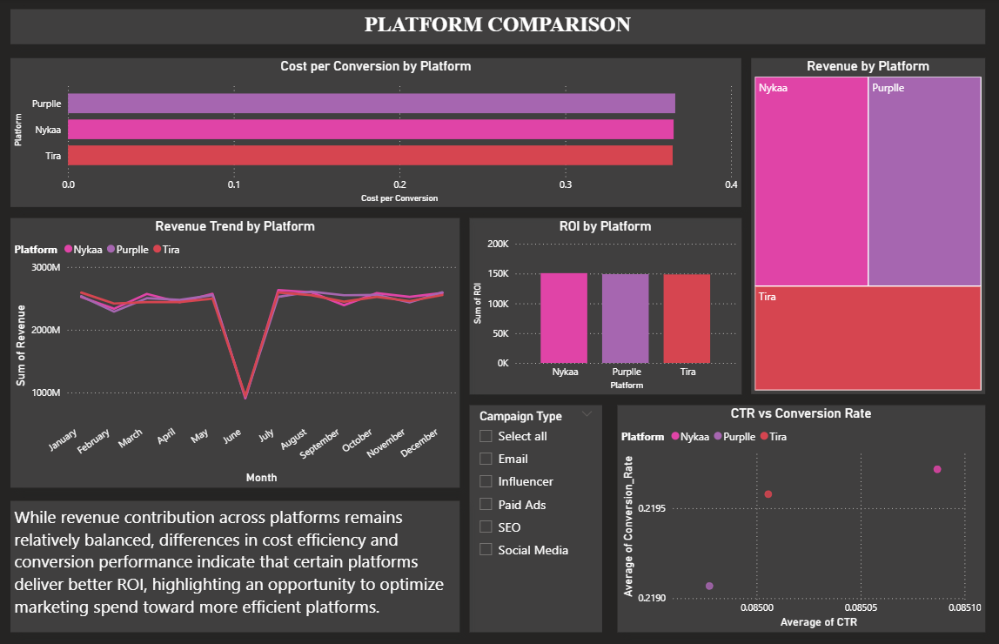
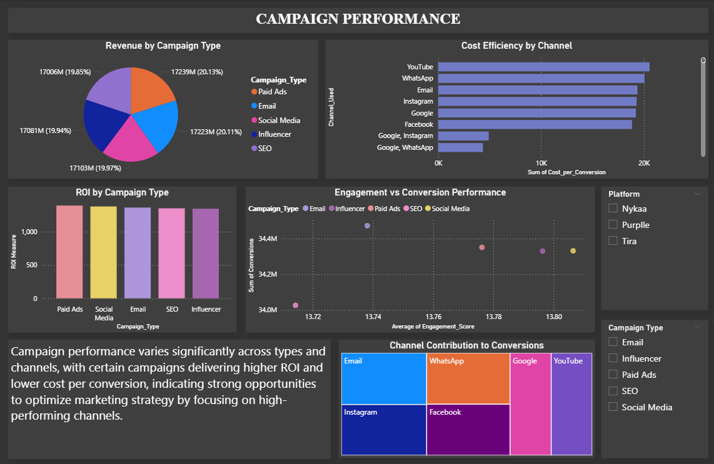

# Multi-Platform Marketing Analytics & ROI Optimization

## Project Overview

This project analyzes marketing campaign performance across multiple e-commerce platforms - **Nykaa, Purplle, and Tira** — to identify key drivers of revenue, optimize marketing spend, and improve conversion efficiency.

The dashboard provides a comprehensive view of:

- Campaign performance
- Platform-wise comparison
- Marketing funnel efficiency
- Channel effectiveness

The goal is to support **data-driven marketing decisions** and improve overall ROI.

## Business Problem

Companies invest heavily in marketing campaigns but often lack clear insights into:

- Which platforms generate the highest returns
- Which channels are cost-efficient
- Where users drop off in the conversion funnel

This project aims to:

- Identify high-performing platforms and campaigns
- Analyze conversion bottlenecks
- Recommend strategies to improve marketing ROI

## Dataset

The dataset consists of marketing campaign data from three platforms:

- Nykaa
- Purplle
- Tira

### Key Features:

- Campaign Type
- Channel Used
- Impressions, Clicks, Conversions
- Revenue & Acquisition Cost
- ROI
- Engagement Score
- Customer Segment

## Tools & Technologies

- **Python (Pandas, NumPy)** – Data cleaning & feature engineering
- **Power BI** – Dashboard creation & visualization
- **Excel** – Initial data exploration

## Key Metrics Used

- **CTR (Click Through Rate)** = Clicks / Impressions
- **Conversion Rate** = Conversions / Clicks
- **ROI** = Revenue / Acquisition Cost
- **Cost per Conversion** = Acquisition Cost / Conversions
- **AOV (Average Order Value)** = Revenue / Conversions

## Dashboard Overview

### Page 1: Overview

- Total Revenue, Spend, ROI, AOV, Conversions
- Revenue contribution by campaign type
- Revenue vs Spend trend
- Marketing Funnel (Impressions → Clicks → Conversions)

_Key Insight:_
A significant drop-off (~1.9%) from clicks to conversions highlights inefficiencies in the final conversion stage.

### Page 2: Platform Comparison

- Revenue distribution across platforms
- ROI comparison
- Cost per conversion analysis
- CTR vs Conversion performance (scatter plot)

_Key Insight:_
While revenue contribution is similar across platforms, differences in efficiency indicate opportunities to optimize budget allocation.

### Page 3: Campaign Performance

- Revenue and ROI by campaign type
- Channel contribution to conversions
- Cost efficiency by channel
- Engagement vs conversion analysis

_Key Insight:_
Certain campaigns and channels deliver higher ROI and lower costs, suggesting strong opportunities for performance optimization.

## Key Insights

- Significant drop in conversion from clicks indicates optimization opportunity in targeting or landing pages
- Some platforms generate similar revenue but differ in efficiency (ROI & cost per conversion)
- High engagement does not always translate to higher conversions
- Certain channels consistently outperform others in cost efficiency

## Business Recommendations

- Optimize conversion stage (landing pages, targeting) to reduce drop-offs
- Reallocate budget toward high ROI platforms and channels
- Focus on high-performing campaign types for better returns
- Improve targeting strategies for high-engagement but low-conversion campaigns

## Project Outcome

This project demonstrates how data analytics can:

- Improve marketing decision-making
- Optimize campaign performance
- Increase ROI through better resource allocation
